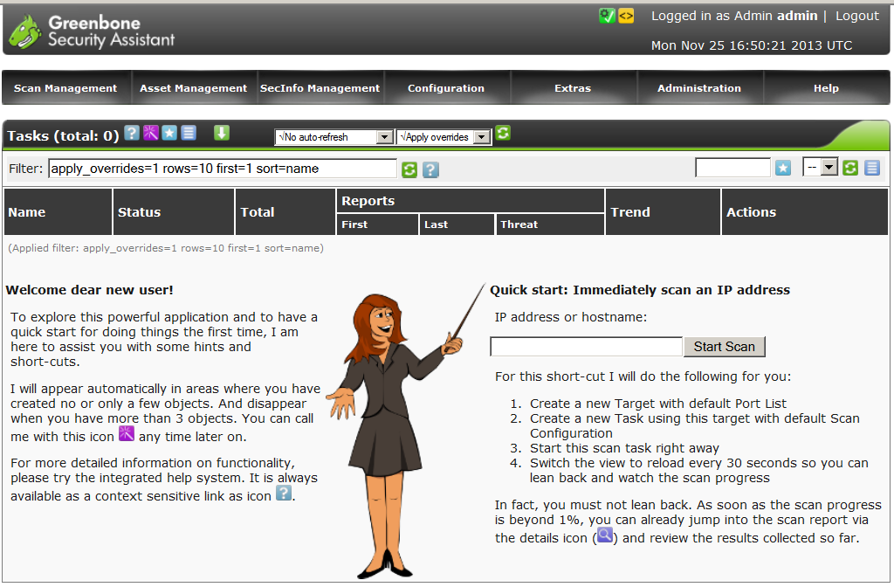
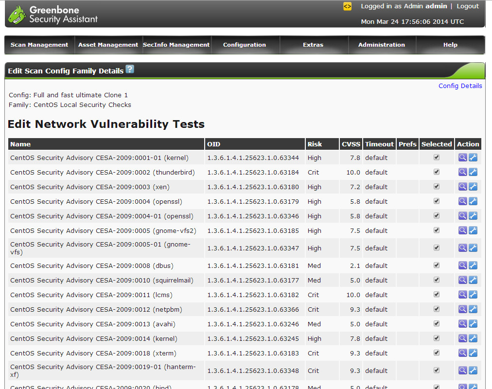

Практическое занятие №1 Работа с программными средствами анализа рисков
=======================================================================

Цель работы:
------------

#. получить практический опыт применения программно-аппаратных средств обеспечения информационной безопасности телекоммуникационных систем;
#. Получить практический опыт выявления технических каналов утечки информации.

Литература:
-----------

#. Мельников, В.П. Информационная безопасность учебное пособие для студентов учреждений среднего профессионального образования. В.П. Мельников, С.А. Клейменов, А.М. Петраков. Москва: Академия, 2012г. стр. 194-202;

Подготовка к работе:
--------------------

#. Подготовить бланк отчета;
#. Изучить предложенную литературу.

Основное оборудование:
----------------------

#. Программа OpenVAS;
#. Виртуальные машины в программе VirtualBox на основе Ubuntu Linux с различными компонентоми;
#. Пакеты прикладных программ LibreOffice.

Задание:
--------

#. Проанализировать уязвимости предложенных ресурсов, выделить и описать угрозы активам, составив отчет о проделанной работе.

Порядок выполнения работы:
--------------------------

#. Изучить теоретический материал по данной теме (15-20 минут);
#. Изучить интерфейс сканера OpenVAS;
#. Подготовить необходимый набор виртуальных машин;
#. Запустить сканер сети OpenVAS. Выяснить ip адрес сканера сети;
#. Запустить виртуальную машину с тестируемым компонентом. Выяснить ip адрес исследуемой машины. Проверить, что исследуемая  машина располагается в одном сегменте сети со сканером сети OpenVAS;
#. При помощи браузера подключиться к веб интерфейсу сканера сети. Выполнить сканирование исследуемой машины. Параллельно запустить сканирование следующей виртуальной машины;
#. Оформить разультаты сканирования в виде отета, в котором указать найденные уязвимости и рекомендации по их устранения;
#. Просканировать все имеющиеся на ПК виртуальные машины. По результатам сканирования оформить общий отчет об уязвимостях систем;
#. Выработать рекомендации по улучшению системы безопасности с учетом проведенного мониторинга;
#. Разработать шаблон политики обновлений в рамках составленного отчета. Шаблон  оформить документально в произвольной форме;
#. Продемонстрировать результаты работы преподавателю.

Содержание отчета:
------------------

#. Цель работы;
#. Содержание действий по выполнению данной работы;
#. Ответы на контрольные вопросы;
#. Вывод.

Контрольные вопросы:
--------------------

#. Что понимают под уязвимостью?
#. Что понимают под угрозой?
#. Что понимают под риском в рамках информационной безопасности?

Приложение:
-----------

Сканеры уязвимостей — это программные или аппаратные средства, служащие для осуществления диагностики и мониторинга сетевых компьютеров, позволяющее сканировать сети, компьютеры и приложения на предмет обнаружения возможных проблем в системе безопасности, оценивать и устранять уязвимости. (Википедия).
Известными коммерческими сканерами являются Nessus, GFI LANguard, XSpider.
В отличии от прочих, OpenVAS бесплатен, работает без каких либо ограничений и может пригодится как сетевым администраторам, так и специалистам ИБ для выявления актуальных проблем своей инфраструктуры. 
Интерфейс GSA вообще не сложен, и хотя не локализован сориентироваться в настройках очень легко. В самом верху расположено меню содержащее 7 пунктов соответствующих определенной задаче или настройкам. После регистрации можно сразу приступить к проверке, в этом поможет мастер встречающий в окне приветствия, по нажатию на фиолетовый значок в панели Tasks. Поле «Quick start: Immediately scan an IP address» (рисунок.1) позволяет сразу же создать задачу для проверки узла или сети. Для этого нужно просто указать IP или имя. Сканирование производится с настройками по умолчанию (Full and fast), выбрав гиперссылку рядом сразу можем просмотреть установки.

       Рисунок 1 Интерфейс openvas_quick_start

Сами политики сканирования настраиваются в Configuration – Scan Configs. Здесь уже имеется 5 политик: одна пустая (empty) и 4 преднастроенные. По количеству тестов (на момент написания этих строк 33144) преднастроенные политики между собой не отличаются. Разница лишь в настройках сканера. Готовые политики делятся также на fast и deep. Вторые не учитывают результаты предыдущих тестов и вся процедура каждый раз повторяется сначала. По опыту скажу что deep редко когда выдает что-то особенное, но вот время сканирования увеличивается в разы. Поэтому при первом сканировании достаточно использовать Full and fast или Full and fast ultimate, в последующем критические системы можно (для самоуспокоения) дополнительно проверить deep политиками. Настройки конкретной политики легко узнать выбрав в поле Actions фиолетовую кнопку «Scan Config Detail» (рисунок.2).

       Рисунок 2 Scan Config Detail

Настройки готовых политик менять нельзя, но их можно экспортировать (зеленая Export Scan Config) или клонировать чтобы создать на их основе свою, для просто нажимаем оранжевую Clone. В результате появляется еще одна политика с окончанием Clone 1. Используя кнопку Edit Scan Config изменяем параметры. Их здесь очень много, все NVT тесты сгруппированы по различным типам операционных систем и сетевого оборудования, содержат настройки nmap, ping, snmpwal, настройки логина, использование ARP, проверки паролей и много другого. Конечно некоторое время потребуется чтобы во всем разобраться (если нет желания использовать установки по умолчанию). Сами тесты могут быть динамическими (добавляются самостоятельно) или статическими.
В подразделе Configuration имеется еще ряд полезных пунктов с которым следует ознакомится, так как затем настройки будут фигурировать в задании. Например, в Targets – Port List задается список портов, которые будут проверяться на конечных узлах. Здесь 9 преднастроек, по умолчанию в задании используется OpenVAS Default. В Targets – Credential указываются учетные записи пользователей от имени которых будет производится подключение к удаленным узлам и проверка системы (если пользователь доменный, то логин указываем в формате домен\логин). Для аутентификации можно использовать как логин и пароль, так и публичный/приватный ключ. В Configuration – Slave добавляются дополнительные OpenVAS Manager, который будет использоваться для проверки узлов. Задания можно запускать вручную, но лучше это производить автоматически во время меньшей загруженности систем. Для этого следует в Configuration – Schedules создать задачи. Выбираем New Schedule и в предложенных полях указываем название, время первого запуска, часовой пояс (если не совпадает с текущим), и периодичность.
Теперь настраиваем узлы которые будут сканироваться. Переходим в Configuration – Target, здесь находим готовое задание для проверки локальной системы и созданное при помощи Quick start. Нажимаем New Target (звездочка) и указываем название, вписываем узлы ( IP, диапазон, имя узла), Port List, подключаем Credential. Возможно прописать все узлы в текстовый файл, который и указать при помощи «From file».
Чтобы создать новую задачу проверки безопасности переходим в раздел Scan Management — New Task, и заполняем поля (рисунок.3): указываем имя и описание, в выпадающих списках выбраем все, что мы раньше настраивали — политику сканирования, узлы, расписание и т. д.	

 .. figure:: _static/new_task.jpg
       :scale: 100 %
       :align: center
       :alt: интерфейс openvas_quick_start

       Рисунок 3 New task
  
Некоторые параметры подписаны как optional их можно не трогать. Нажимаем Create Task, задача появляется в Scan Management — Task. Текущее состояние отображается в поле Status, в поле Actions находятся кнопки позволяющие управлять задачей: запустить, остановить, изменить настройки, клонировать, экспортировать и т. д. Нажимаем Start и ожидаем окончания сканирования (перед этим лучше установить автообновление окна, чтобы видеть прогресс). По окончании сканирования можем просмотреть отчет, для этого следует нажать на Task Detail (рисунок.4).

 .. figure:: _static/task_detail.jpg
       :scale: 100 %
       :align: center
       :alt: интерфейс openvas_quick_start

       Рисунок 4 Task detail

Отчет содержит две позиции Threat (угрозы) и Scan Results. Все предупреждения разбиты на 4 позиций по уровню опасности. Основное внимание следует обратить на High, Medium и Low, которые собственно и указывают на проблемы. Отчеты None, Log и False Pos показывают обычно предупреждения о неудачных операциях. Подробный отчет можно увидеть нажав Details, и затем выбрать формат для экспорта (PDF, TXT, HTML, XML и другие) и при необходимости фильтры. Кнопка Compare позволяет сравнить отчеты. Это очень полезная операция, позволяющая увидеть что изменилось со времени последнего сканирования, например оценить эффективность принятых мер безопасности.
В Asset Management — Hosts доступен еще один вид отчета Prognostic Report позволяющий оценить все предупреждения относящиеся к конкретнуму узлу полученные в ходе предыдущих проверок. Вполне вероятно что некоторые отчеты сканера могут содержать ложные срабатывания, чтобы они не мешали используется раздел Override В Note можно прописывать некоторое объяснение которое привязывается к NVT тесту.
Периодически следует обновлять NVT/SCAP/CERT базы, все настройки находятся в Administration, в трех одноименных разделах. Кроме этого можно использовать консольные команды:
:: 

 openvas-nvt-sync
 openvas-scapdata-sync
 openvas-certdata-sync
 openvassd
 openvasmd --rebuild
 killall openvassd
 /etc/init.d/openvas-scanner restart
 /etc/init.d/openvas-manager restart
 /etc/init.d/openvas-administrator restart
 /etc/init.d/greenbone-security-assistant restart

Демонстрация работы с OpenVAS представлена на видео ниже